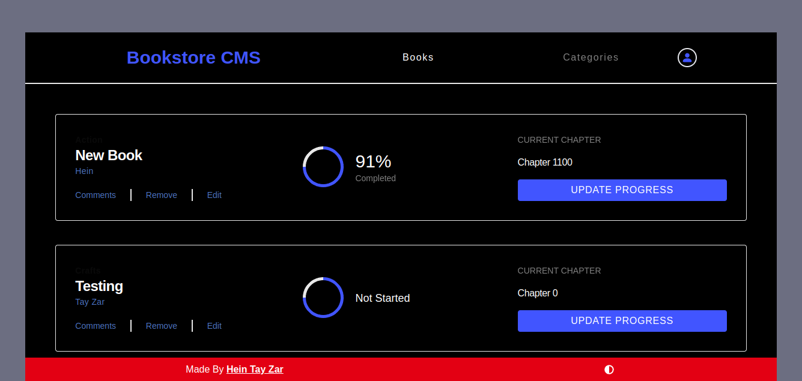

# Bookstore
<a name="readme-top"></a>
<div align="center">

  <!--  -->
  <br/>
</div>

<!-- TABLE OF CONTENTS -->

# 📗 Table of Contents

- [Bookstore](#Bookstore)
- [📗 Table of Contents](#-table-of-contents)
- [📖 \[Bookstore\] ](#-Bookstore-)
  - [🛠 Built With ](#-built-with-)
    - [Tech Stack ](#tech-stack-)
    - [Key Features ](#key-features-)
  - [🚀 Live Demo ](#-live-demo-)
  - [💻 Getting Started ](#-getting-started-)
    - [Prerequisites](#prerequisites)
    - [Setup](#setup)
    - [Install](#install)
    - [Usage](#usage)
    - [Run tests](#run-tests)
    - [Deployment](#deployment)
  - [👥 Authors ](#-authors-)
  - [🔭 Future Features ](#-future-features-)
  - [🤝 Contributing ](#-contributing-)
  - [⭐️ Show your support ](#️-show-your-support-)
  - [🙏 Acknowledgments ](#-acknowledgments-)
  - [❓ FAQ ](#-faq-)
  - [📝 License ](#-license-)


<!-- PROJECT DESCRIPTION -->

# 📖 [Bookstore] <a name="about-project"></a>
> BookStore-CMS is a React and Firebase-powered web application designed for book enthusiasts who want to manage their book collection and categories with ease. The app allows users to perform basic CRUD (Create, Read, Update, Delete) operations on books, enabling them to add, edit, and remove books from their collection. Additionally, users can create new categories for their books, providing a convenient way to organize their collection. With a user-friendly interface and robust functionality, BookStore-CMS is the ultimate solution for anyone who wants to keep track of their books in a seamless and efficient manner.


## 🛠 Built With <a name="built-with"></a>

### Tech Stack <a name="tech-stack"></a>

- React
<details>
  <summary>Client</summary>
  <ul>
    <li><a href="https://reactjs.org/">React</a></li>
  </ul>
</details>


### Key Features <a name="key-features"></a>

- All users can freely see other people books and their categories and make crud operations
- All users can make new categories


<p align="right">(<a href="#readme-top">back to top</a>)</p>

<!-- LIVE DEMO -->

## 🚀 Live Demo <a name="live-demo"></a>

[Live Version](https://bookstore-cms.vercel.app/)

<p align="right">(<a href="#readme-top">back to top</a>)</p>

<!-- GETTING STARTED -->

## 💻 Getting Started <a name="getting-started"></a>

To get a local copy up and running, follow these steps.

### Prerequisites

In order to run this project you need:

- Basic Knowledge of HTML, CSS, & JavaScript.
- Basice Knowledge of Tailwindcss
- Basic knowledge of ES6 syntax.
- Basic knowledge of Git, GitHub &Gitflow.
- Basic knowledge of Linters.
- Basic knowledge of Webpack.
- Basic Knowledge of React
- Basic knowledge of Vitest unit-testing library.
- Basic knowledge of VS Code or any other code-editors.

### Setup

Clone this repository to your desired folder:

```sh
  cd Bookstore
  git clone https://github.com/heintayzar-hm/Bookstore.git
```


### Install

Install this project with:(legnacy might require)


```sh
  npm install
```


### Usage

To run the project, execute the following command:


```sh
  npm run dev
```

### Run tests

To run tests, run the following command:


```sh
  npm run test
```

### Deployment

You can deploy this project using: vercel


```sh
  npm run deploy
```


<p align="right">(<a href="#readme-top">back to top</a>)</p>

<!-- AUTHORS -->

## 👥 Authors <a name="authors"></a>


👤 **Hein Tay Zar**

- GitHub: [@Hein Tay](https://github.com/heintayzar-hm)
- Twitter: [@Hein Tay](https://twitter.com/heintayzarhm)
- LinkedIn: [Hein Tay](https://www.linkedin.com/in/hein-tay-zar)

<p align="right">(<a href="#readme-top">back to top</a>)</p>

<!-- FUTURE FEATURES -->

## 🔭 Future Features <a name="future-features"></a>

<p align="right">(<a href="#readme-top">back to top</a>)</p>

<!-- CONTRIBUTING -->

## 🤝 Contributing <a name="contributing"></a>

Contributions, issues, and feature requests are welcome!

Feel free to check the [issues page](https://github.com/heintayzar-hm/Bookstore.git/issues).

<p align="right">(<a href="#readme-top">back to top</a>)</p>

<!-- SUPPORT -->

## ⭐️ Show your support <a name="support"></a>

If you like this project and would like to have us contribute to your project, kindly shoot us a message to our individual handles above.

<p align="right">(<a href="#readme-top">back to top</a>)</p>

<!-- ACKNOWLEDGEMENTS -->

## 🙏 Acknowledgments <a name="acknowledgements"></a>


<p align="right">(<a href="#readme-top">back to top</a>)</p>

<!-- FAQ (optional) -->

## ❓ FAQ <a name="faq"></a>


- **[Question_1]**

  - [Answer_1]

- **[Question_2]**

  - [Answer_2]

<p align="right">(<a href="#readme-top">back to top</a>)</p>

<!-- LICENSE -->

## 📝 License <a name="license"></a>

This project is [MIT](./LICENSE) licensed.


<p align="right">(<a href="#readme-top">back to top</a>)</p>
